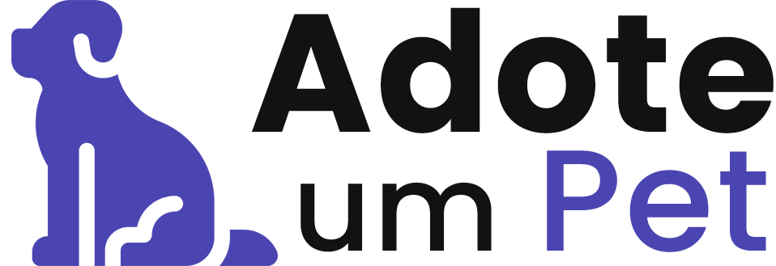
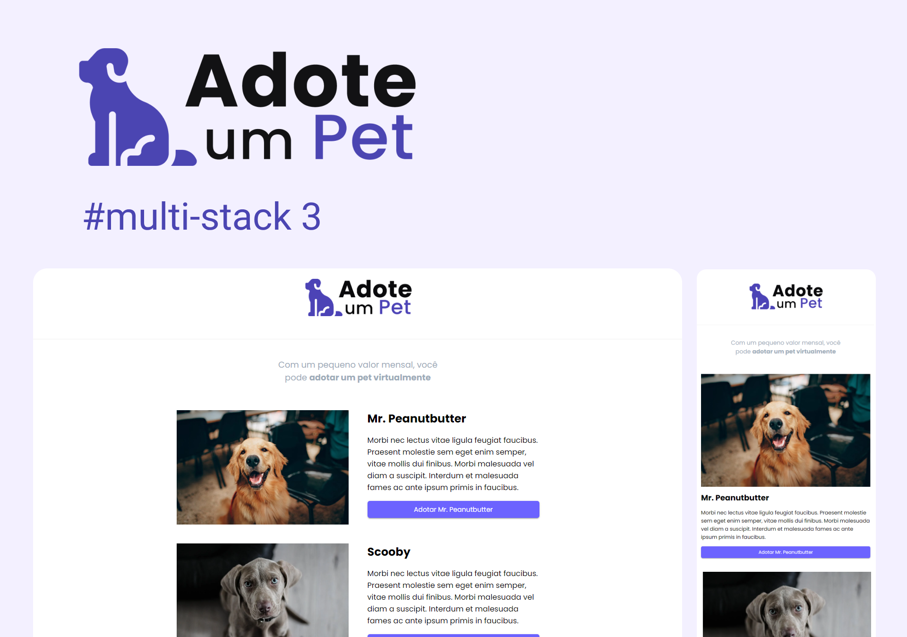
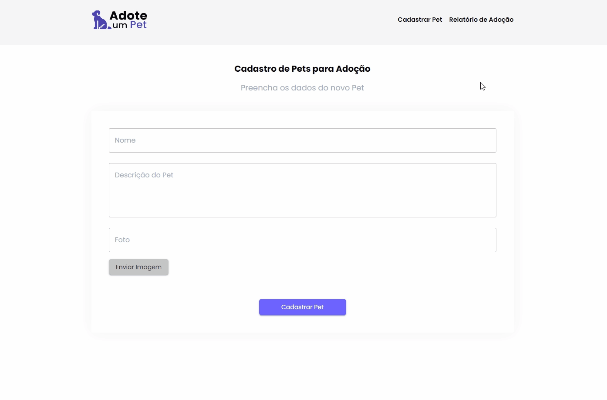
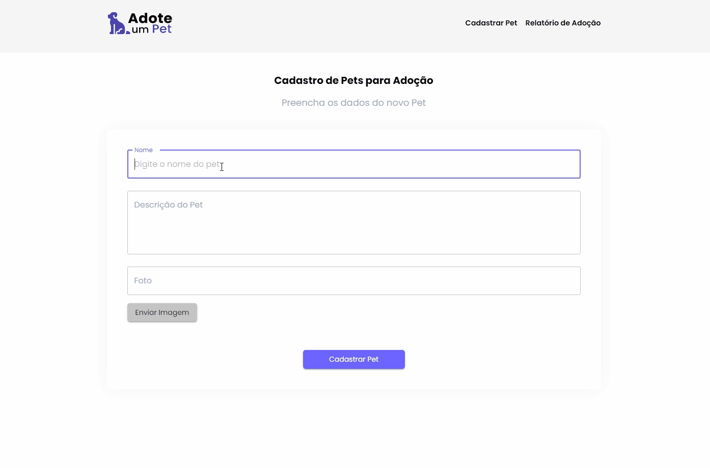
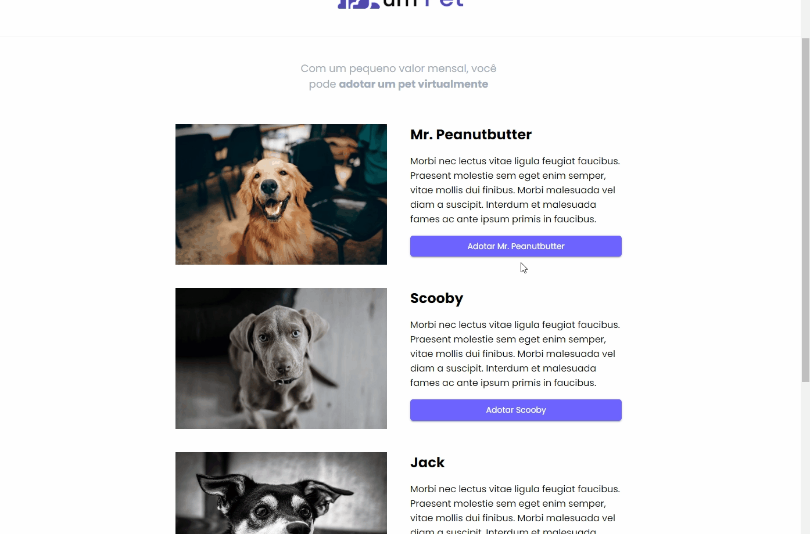
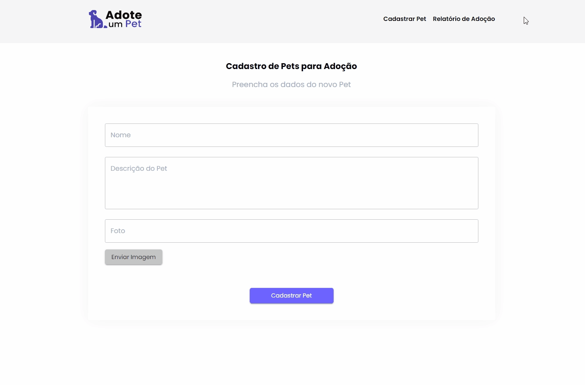
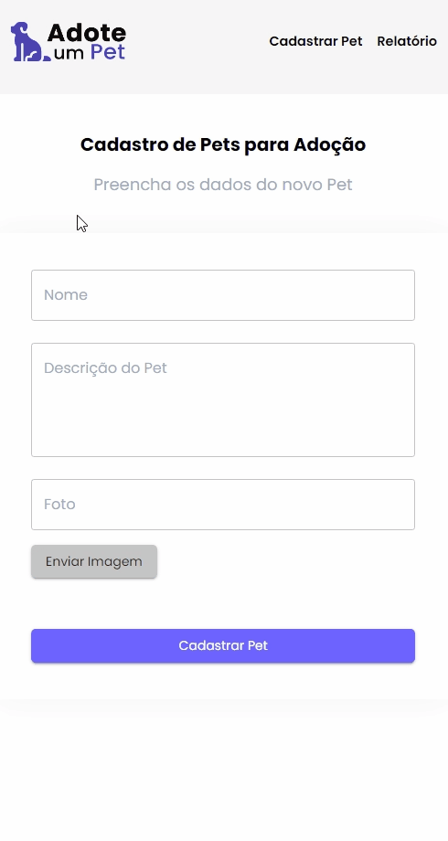

<h1 align="center">
    
</h1>

<div align="center">
    <h3> 🔵 Com um pequeno valor mensal, você pode adotar um pet virtualmente. 🔵 </h3>
    <a href="https://www.treinaweb.com.br/" target="_blank">
      
    </a>
    <a href="https://github.com/PedroCantanhede" target="_blank">
      
    </a>
     
    
    
</div>

# Adote um Pet

O Adote um Pet é uma aplicação realizada na semana Multi-Stack da Treina Web com intuito de criar uma plataforma para adotar seu pet virtualmente contribuindo com um valor mensal.

<p align="center">
  
</p>

# 🔨 Tecnologias

💻 React

💻 NextJS

💻 Axios

💻 TypeScript

💻 NodeJS

💻 Java / Spring

💻 H2 Database

## :camera: Veja:

### Aplicação











## :rocket: Instalação

```bash
# Clone o repositório
$ git clone https://github.com/PedroCantanhede/Adote-Pet.git

# Entre na pasta do projeto
$ cd pets

# Instale as dependências
$ npm install / yarn install

# Execute a aplicação no Front na pasta pets
$ npm run dev / yarn dev

# Abra o projeto na porta: 3000 - acessando: http://localhost:3000

# Execute a aplicação no Back na pasta pets/backend/adote-um-pet
$ mvn spring-boot:run

```
## 🔖 Layout

Você pode visualizar os desafios do projeto através [desse link](https://treinaweb.notion.site/Multi-stack-03-014eb20e49e44559bc3c74fe7c05acad). É necessário ter conta no [Notion](https://www.notion.so/) para acessá-lo.

## :infinity: Ajuda da Treina Web

A ajuda das aulas disponibilizadas durante a semana e a comunidade dos professores da Treina Web foram essenciais para que eu chegasse no final do projeto. Deixo também meus agradecimentos a toda equipe.
